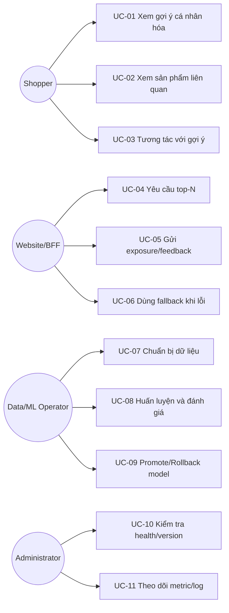

# Stakeholders và Use Cases

| Thuộc tính | Giá trị |
|---|---|
| **Mã tài liệu** | `BUS-03` |
| **Phiên bản** | `1.0.0` |
| **Ngày cập nhật** | `2026-07-18` |
| **Trạng thái** | Baseline thiết kế |
| **Chủ sở hữu** | Nhóm dự án RecoBridge |

> **Quy ước:** Nội dung ghi **MVP** là phạm vi phải demo. Nội dung ghi **Target** là kiến trúc định hướng, không được trình bày như chức năng đã hiện thực nếu chưa có bằng chứng chạy thực tế.

## 1. Stakeholder matrix

| Stakeholder | Mối quan tâm | Tiêu chí chấp nhận |
|---|---|---|
| Giảng viên/hội đồng | Đúng đề, tích hợp có chiều sâu, demo thật | Architecture + integrity + working flow |
| Shopper | Gợi ý liên quan, không làm chậm trang | latency và relevance |
| Chủ website | Dễ tích hợp, rollback được | API ổn định, fallback, observability |
| Data/ML team | Dữ liệu tái lập, metric rõ | pipeline + versioning |
| Backend team | Contract rõ, lỗi dự đoán được | OpenAPI + error model + idempotency |
| QA | Testable và truy vết được | acceptance criteria + logs |

## 2. Use-case overview

## 3. Use case quan trọng

### UC-04 — Yêu cầu top-N

**Tiền điều kiện:** API sẵn sàng; catalog serving đã nạp.  
**Luồng chính:**

1. Website tạo `request_id` hoặc để service sinh.
2. Gửi user/session/context/top_k.
3. Service resolve feature và candidate strategy.
4. XGBoost score/re-rank candidates.
5. Post-filter theo catalog/business rules.
6. Response trả item, score/rank, strategy, model version và latency.
7. Website render và gửi exposure khi item thực sự hiển thị.

**Luồng thay thế:** feature thiếu → cluster/popularity; model lỗi → cached fallback; request sai → 4xx, không retry.

### UC-05 — Gửi feedback

1. Website gửi `Idempotency-Key` và `request_id`.
2. API validate event và actor/context.
3. Ghi event + outbox trong một transaction hoặc ghi trực tiếp bền vững ở MVP.
4. Trả `202 Accepted`/`200 OK` cùng event ID.
5. Request lặp trả kết quả deduplicated, không tạo event thứ hai.

### UC-09 — Promote model

1. Train pipeline sinh model artifact và report.
2. So sánh baseline theo NDCG/Recall/coverage và guardrails.
3. Nếu đạt ngưỡng, gắn alias `candidate` rồi triển khai staging.
4. Smoke test API và shadow replay.
5. Promote `production`; giữ model trước để rollback.
