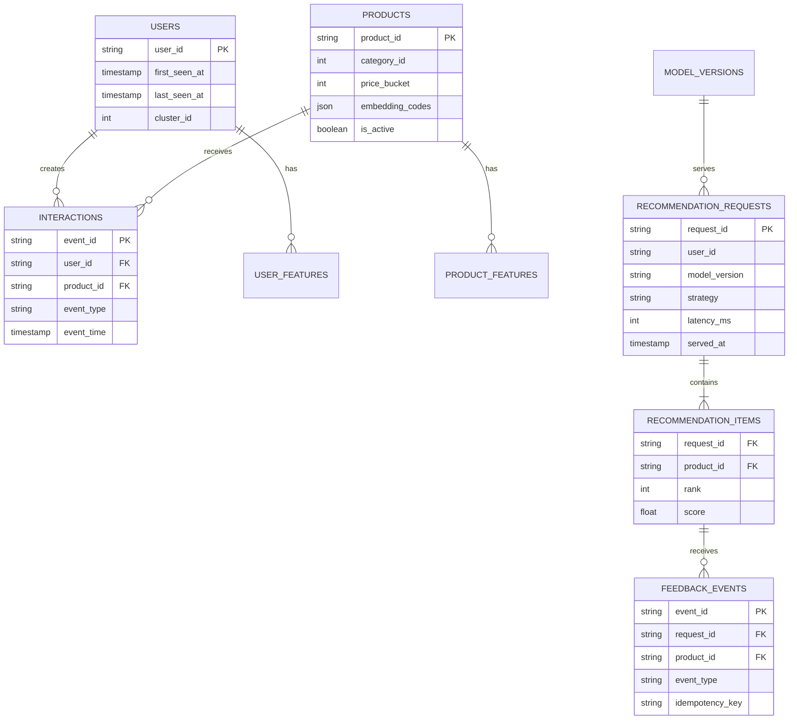

# Data Dictionary và ánh xạ

| Thuộc tính | Giá trị |
|---|---|
| **Mã tài liệu** | `DAT-02` |
| **Phiên bản** | `1.0.0` |
| **Ngày cập nhật** | `2026-07-18` |
| **Trạng thái** | Baseline thiết kế |
| **Chủ sở hữu** | Nhóm dự án RecoBridge |

> **Quy ước:** Nội dung ghi **MVP** là phạm vi phải demo. Nội dung ghi **Target** là kiến trúc định hướng, không được trình bày như chức năng đã hiện thực nếu chưa có bằng chứng chạy thực tế.

## 1. Raw schema contract

Pipeline phải introspect Parquet schema. Bảng dưới là contract logic, không được dùng thay việc kiểm tra file thực.

| Entity | Field | Loại logic | Bắt buộc | Ghi chú |
|---|---|---|---:|---|
| Event | `client_id` | int64 | Có | user pseudonymous ID |
| Event | `timestamp` | datetime UTC-normalized | Có | parse từ chuỗi/object |
| Item event | `sku` | int64 | Có | product ID |
| Page visit | `url` | int64 | Có | không suy diễn thành sku |
| Search | `query` | array[int] | Có | quantized embedding; chiều phải introspect |
| Product | `category` | int64 | Có | anonymized category |
| Product | `price` | int64 | Có | price bucket, không phải currency |
| Product | `name` hoặc `embedding` | array[int] | Có | tên trường tùy file/version |

## 2. Canonical event model

| Field | Type | Ý nghĩa |
|---|---|---|
| `event_id` | UUID/string | ID nội bộ deterministic hoặc generated |
| `event_time` | timestamptz | thời gian chuẩn hóa |
| `event_type` | enum | BUY, ADD_TO_CART, REMOVE_FROM_CART, PAGE_VISIT, SEARCH |
| `user_id` | string | pseudonymized client_id |
| `product_id` | string nullable | chỉ có ở item events |
| `url_id` | string nullable | page_visit |
| `search_vector` | array nullable | search_query |
| `source_dataset` | string | lineage |
| `source_partition` | string | file/date partition |
| `ingested_at` | timestamptz | audit |

## 3. Serving data model

## 4. Mapping

| Synerise | Canonical | Serving/feature use |
|---|---|---|
| `client_id` | `user_id` | cluster, history, API user context |
| `sku` | `product_id` | catalog, candidates, response |
| `timestamp` | `event_time` | recency, windows, split |
| `category` | `category_id` | affinity, cluster profile |
| `price` | `price_bucket` | preference distribution |
| quantized name | `product_embedding_codes` | similarity/encoded features |

## 5. Keys và constraints

- `products.product_id` unique.
- `recommendation_items(request_id, product_id)` unique.
- `feedback_events(source, idempotency_key)` unique.
- Event raw dedup key đề xuất: hash `(event_type, client_id, timestamp, sku/url/query_hash)`.
- Không dùng timestamp đơn lẻ làm primary key.
