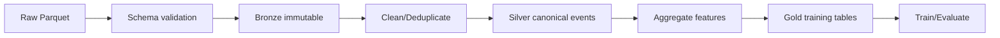

# Chất lượng dữ liệu và tiền xử lý

| Thuộc tính | Giá trị |
|---|---|
| **Mã tài liệu** | `DAT-03` |
| **Phiên bản** | `1.0.0` |
| **Ngày cập nhật** | `2026-07-18` |
| **Trạng thái** | Baseline thiết kế |
| **Chủ sở hữu** | Nhóm dự án RecoBridge |

> **Quy ước:** Nội dung ghi **MVP** là phạm vi phải demo. Nội dung ghi **Target** là kiến trúc định hướng, không được trình bày như chức năng đã hiện thực nếu chưa có bằng chứng chạy thực tế.


## 1. Pipeline lớp dữ liệu



## 2. Quality checks

| Check | Rule | Hành động khi lỗi |
|---|---|---|
| Schema | field/type nằm trong accepted variants | fail-fast, lưu schema snapshot |
| Required IDs | client_id và event-specific key không null | quarantine |
| Timestamp | parse được và trong dataset horizon | quarantine/report |
| Duplicates | canonical dedup key unique | keep-first hoặc deterministic rule |
| Product join | item event join được product_properties | report unmatched; không âm thầm drop |
| Vector | array số, chiều nhất quán trong partition | fail partition nếu drift không giải thích |
| Category/price | thuộc domain quan sát | report cardinality drift |

## 3. Các bước tiền xử lý

1. Scan metadata bằng PyArrow/Polars, không đọc toàn bộ file vào RAM.
2. Chuẩn hóa timestamp và timezone; lưu UTC.
3. Gắn lineage: file, partition, ingestion run ID.
4. Deduplicate raw events.
5. Tạo canonical event table.
6. Join product properties cho item events.
7. Sessionize theo inactivity gap được công bố, ví dụ 30 phút; đây là tham số dự án, không phải nhãn gốc.
8. Tạo rolling features 1/7/30/90 ngày.
9. Chuẩn hóa feature số trước K-Means.
10. Tạo time-based train/validation/test.

## 4. Sampling strategy cho MVP

Không lấy ngẫu nhiên từng dòng độc lập vì phá chuỗi hành vi. Ưu tiên:

- chọn tập user theo hash ổn định;
- lấy toàn bộ lịch sử của user đã chọn trong horizon;
- đặt ngưỡng tối thiểu số item event;
- giữ tỷ lệ event và dải hoạt động khác nhau;
- công bố seed, hash rule và số user/event cuối.

Ví dụ:

```text
selected_user = hash(client_id, seed) mod 100 < sample_percent
```

## 5. Data leakage controls

- Feature cutoff phải nhỏ hơn thời điểm label window.
- Popularity/item statistics chỉ tính từ dữ liệu trước cutoff.
- StandardScaler/PCA/K-Means fit trên train, không fit toàn bộ dataset.
- Candidate pool cho validation/test không dùng outcome tương lai.
- User cluster trong validation/test được gán bằng model train đã fit.

## 6. Artifacts bắt buộc

- `schema_snapshot.json`
- `data_quality_report.json`
- `sampling_manifest.json`
- `feature_schema.json`
- `split_manifest.json`
- row counts theo stage
- checksum hoặc version của source files
