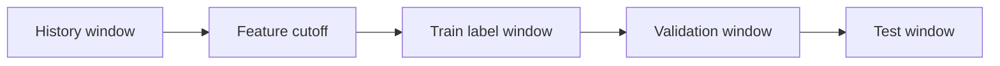

# Labeling, negative sampling và time split

| Thuộc tính | Giá trị |
|---|---|
| **Mã tài liệu** | `DAT-04` |
| **Phiên bản** | `1.0.0` |
| **Ngày cập nhật** | `2026-07-18` |
| **Trạng thái** | Baseline thiết kế |
| **Chủ sở hữu** | Nhóm dự án RecoBridge |

> **Quy ước:** Nội dung ghi **MVP** là phạm vi phải demo. Nội dung ghi **Target** là kiến trúc định hướng, không được trình bày như chức năng đã hiện thực nếu chưa có bằng chứng chạy thực tế.

## 1. Mục tiêu dự đoán

### Baseline dễ triển khai

Dự đoán xác suất user mua item trong cửa sổ tương lai. Label nhị phân:

- `1`: có `product_buy` trong label window;
- `0`: candidate được chọn nhưng không mua trong window.

### Target ranking

Dùng relevance đa mức trong cùng query group:

| Outcome | Label đề xuất |
|---|---:|
| no observed action | 0 |
| add_to_cart | 1 |
| product_buy | 2 |

Không nên tự gán `page_visit` thành item relevance vì không có URL→SKU mapping.

## 2. Query group (`qid`)

Một qid phải đại diện cho một quyết định ranking có chung context, ví dụ:

- `(user_id, cutoff_date)` cho offline replay;
- `(user_id, session_id, request_timestamp)` cho operational logs.

Mọi candidate trong cùng qid phải được xếp liền nhau trước khi fit XGBRanker.

## 3. Candidate generation

Ưu tiên union của:

1. global/recent popular;
2. popular theo user cluster;
3. popular theo category affinity;
4. items tương tự history bằng category/quantized embedding;
5. exploration nhỏ trong operational phase.

Candidate pool giới hạn 100–300 item là target thiết kế; giá trị cuối phải benchmark.

## 4. Negative sampling

Vì Synerise thiếu exposure history, không được gọi sample âm là “đã thấy nhưng không click”. Đây chỉ là **unobserved candidate negatives**.

Chiến lược:

- negatives cùng candidate generator và cùng cutoff;
- mix hard negatives (cùng category/price preference) và popular negatives;
- tránh lấy item xuất hiện sau cutoff hoặc item không active;
- giới hạn tỷ lệ negative:positive để không làm dataset phình vô hạn;
- đánh giá sensitivity theo nhiều ratio.

Operational logs sau này nên dùng exposed-but-no-action làm negative có chất lượng cao hơn.

## 5. Time split

Khuyến nghị:

- Train: phần đầu horizon.
- Validation: 14 ngày tiếp theo hoặc window phù hợp sample.
- Test: window cuối, chỉ dùng một lần cho báo cáo cuối.
- Không tune trên test.

## 6. Biases cần báo cáo

- Selection bias do sample users.
- Popularity bias do candidate generator.
- Survivorship bias nếu chỉ giữ active buyers.
- Label ambiguity của remove_from_cart.
- Exposure bias không thể hiệu chỉnh đầy đủ trên historical dataset.
