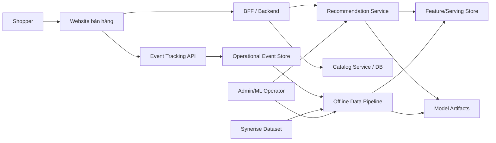
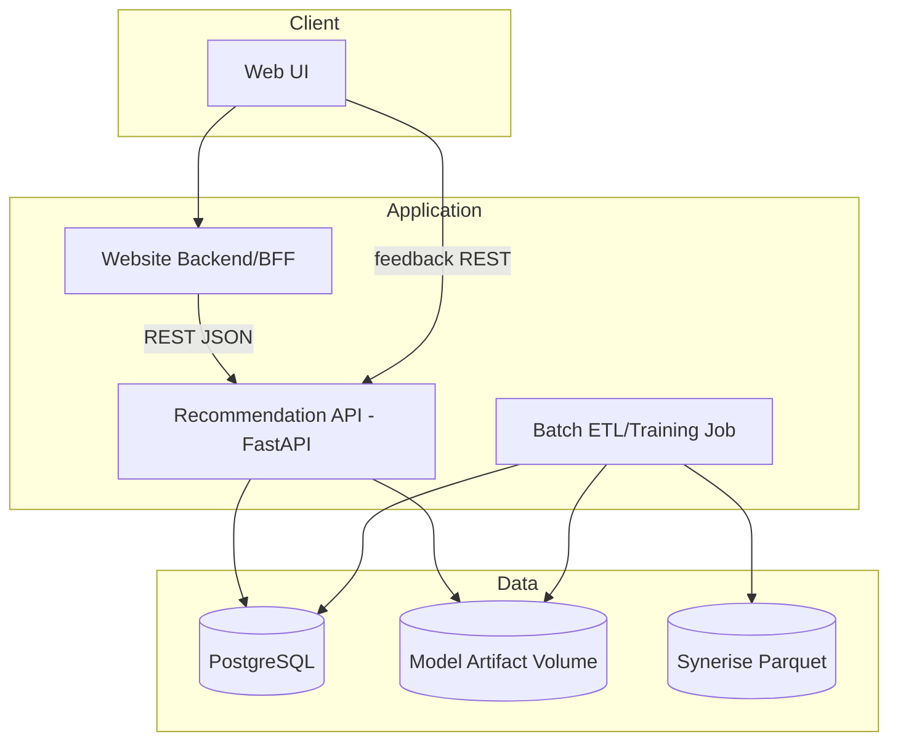

# Kiến trúc hệ thống

| Thuộc tính | Giá trị |
|---|---|
| **Mã tài liệu** | `ARC-01` |
| **Phiên bản** | `1.0.0` |
| **Ngày cập nhật** | `2026-07-18` |
| **Trạng thái** | Baseline thiết kế |
| **Chủ sở hữu** | Nhóm dự án RecoBridge |

> **Quy ước:** Nội dung ghi **MVP** là phạm vi phải demo. Nội dung ghi **Target** là kiến trúc định hướng, không được trình bày như chức năng đã hiện thực nếu chưa có bằng chứng chạy thực tế.

## 1. Context diagram

## 2. Container architecture MVP

## 3. Tách offline và online

### Offline plane

- ingest/validate/sampling;
- feature aggregation;
- K-Means fit và cluster assignment;
- candidate statistics;
- XGBoost training/evaluation;
- model registry/artifact export.

### Online plane

- request validation/authentication;
- retrieve user/context features;
- generate candidates;
- score/re-rank/post-filter;
- cache/fallback;
- return response và log request.

Không chạy full ETL hoặc model training trong request path.

## 4. Kiến trúc target, không bắt buộc MVP

- Message broker cho high-throughput feedback ingestion.
- Feature store online/offline đồng bộ.
- Model registry chuyên dụng.
- Kubernetes autoscaling/canary.
- A/B experimentation service.

## 5. Quality attributes

| Thuộc tính | Cơ chế |
|---|---|
| Latency | candidate cap, precomputed features và in-memory read-only lookup |
| Reliability | timeout, retry có điều kiện, circuit breaker, fallback |
| Integrity | idempotency key, unique constraint và PostgreSQL transaction |
| Scalability | stateless API, batch partitioning |
| Auditability | request_id, model_version, feature_version |
| Evolvability | versioned API và model contract |
