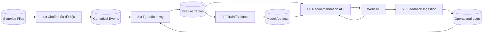
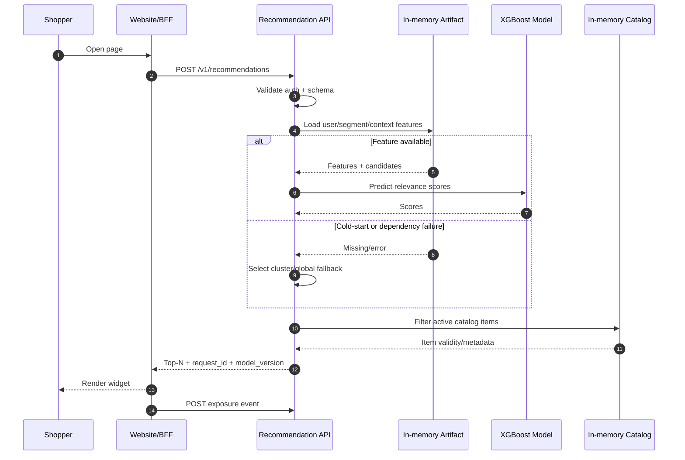
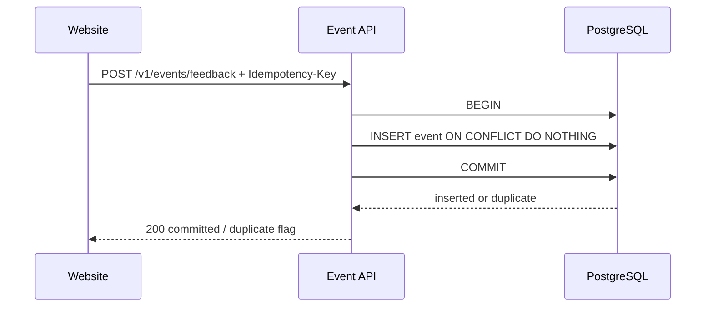
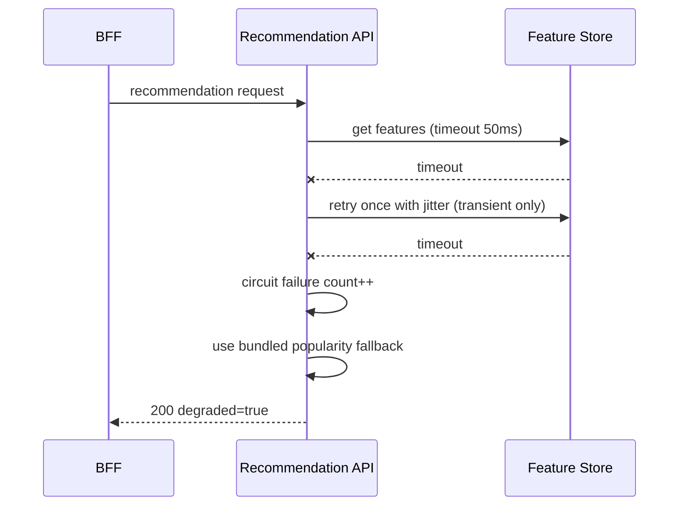

# Data Flow và Sequence Diagrams

| Thuộc tính | Giá trị |
|---|---|
| **Mã tài liệu** | `ARC-02` |
| **Phiên bản** | `1.0.0` |
| **Ngày cập nhật** | `2026-07-18` |
| **Trạng thái** | Baseline thiết kế |
| **Chủ sở hữu** | Nhóm dự án RecoBridge |

> **Quy ước:** Nội dung ghi **MVP** là phạm vi phải demo. Nội dung ghi **Target** là kiến trúc định hướng, không được trình bày như chức năng đã hiện thực nếu chưa có bằng chứng chạy thực tế.

## 1. Data Flow Level 0

## 2. Recommendation request sequence

## 3. Feedback sequence với idempotency

## 4. Failure sequence

## 5. Điểm kiểm soát

- Không retry validation/auth errors.
- `200 degraded=true` chỉ khi fallback vẫn là response hợp lệ; nếu không có dữ liệu fallback, trả 503.
- Exposure chỉ gửi sau khi widget thực sự render/visible, không ngay khi API trả response.
