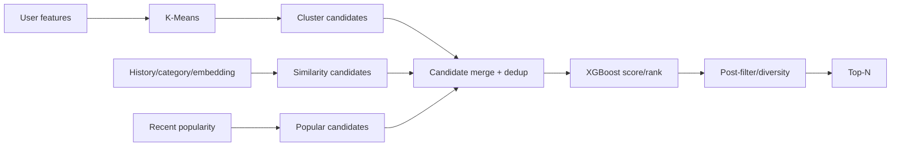

# Bài toán ML và chiến lược mô hình

| Thuộc tính | Giá trị |
|---|---|
| **Mã tài liệu** | `ML-01` |
| **Phiên bản** | `1.0.0` |
| **Ngày cập nhật** | `2026-07-18` |
| **Trạng thái** | Baseline thiết kế |
| **Chủ sở hữu** | Nhóm dự án RecoBridge |

> **Quy ước:** Nội dung ghi **MVP** là phạm vi phải demo. Nội dung ghi **Target** là kiến trúc định hướng, không được trình bày như chức năng đã hiện thực nếu chưa có bằng chứng chạy thực tế.

## 1. Bài toán

RecoBridge không chỉ “dự đoán user thích item nào”; pipeline gồm:

1. xây user/product/context features;
2. sinh tập ứng viên có recall cao;
3. score/rank ứng viên;
4. post-filter và diversity/business rules;
5. serve top-N với latency thấp.

## 2. Baselines bắt buộc

- Global popular.
- Recent popular.
- Cluster popular.
- Same-category popular.

Không đánh giá XGBoost nếu chưa có baseline; metric tuyệt đối không cho biết model có tạo giá trị bổ sung hay không.

## 3. Vai trò K-Means

Input: standardized user aggregates, ví dụ recency, buy/cart/remove/search/page counts, ratios, category/price distributions và vector giảm chiều. Output: `cluster_id`, distance-to-centroid và cluster profile.

K-Means phù hợp vì dễ giải thích và scale, nhưng giả định cluster tương đối convex/isotropic và cần chọn `k`. Silhouette tốt không đồng nghĩa recommendation tăng conversion.

## 4. Vai trò XGBoost

### Giai đoạn 1

`XGBClassifier` dự đoán purchase propensity cho candidate pairs, giúp hoàn thiện pipeline nhanh.

### Giai đoạn 2

`XGBRanker(objective="rank:ndcg")`, qid theo user/cutoff hoặc request. Relevance có thể binary hoặc graded. XGBoost hỗ trợ `rank:ndcg`, `rank:map`, `rank:pairwise`; lựa chọn phụ thuộc label và metric mục tiêu.

## 5. Hybrid flow

## 6. Cold-start

- New user: global/recent popular + context/category.
- Sparse user: cluster-level popular.
- New item: category/price/embedding similarity; không có purchase stats.
- Unknown catalog item: loại khỏi serving.

## 7. Không nên làm

- Dùng K-Means cluster label như ground truth preference.
- Huấn luyện XGBoost trên mọi user×item pair.
- Tối ưu chỉ accuracy mà bỏ coverage/diversity.
- Dùng test set nhiều lần để tune.
