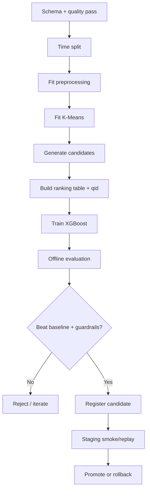

# Huấn luyện và đánh giá

| Thuộc tính | Giá trị |
|---|---|
| **Mã tài liệu** | `ML-03` |
| **Phiên bản** | `1.0.0` |
| **Ngày cập nhật** | `2026-07-18` |
| **Trạng thái** | Baseline thiết kế |
| **Chủ sở hữu** | Nhóm dự án RecoBridge |

> **Quy ước:** Nội dung ghi **MVP** là phạm vi phải demo. Nội dung ghi **Target** là kiến trúc định hướng, không được trình bày như chức năng đã hiện thực nếu chưa có bằng chứng chạy thực tế.

## 1. Training pipeline

## 2. Metric set

| Tầng | Metrics |
|---|---|
| Candidate | Recall@100/300, candidate coverage |
| Ranker | NDCG@10, Recall@10, MRR/MAP phù hợp label |
| Catalog | coverage, long-tail share, novelty, diversity |
| Cluster | silhouette, Davies–Bouldin, size balance |
| System | latency, error rate, cache hit |
| Business online | CTR/ATC/CVR — chỉ khi có traffic thật |

## 3. Evaluation protocol

- So sánh cùng candidate pool và split.
- Report confidence interval hoặc bootstrap theo user/query nếu khả thi.
- Slice: new/sparse/active users, popular/long-tail items, category/price bucket.
- Report mean và distribution; không chỉ một số tổng hợp.
- Ablation: bỏ cluster, bỏ embedding, bỏ recent features để biết đóng góp.

## 4. Model promotion gate mẫu

Model candidate chỉ promote khi:

- NDCG@10 không thấp hơn baseline và đạt target chốt sau vòng đầu;
- candidate recall đủ để ranker có cơ hội;
- coverage/long-tail không giảm quá guardrail;
- inference latency trong budget;
- không có schema mismatch;
- artifact, feature version và report đầy đủ.

## 5. Reproducibility

Lưu:

- git commit;
- dataset/source checksum;
- sampling/split manifest;
- feature schema version;
- random seeds;
- hyperparameters;
- library versions;
- model artifact checksum;
- metrics JSON và plots.

## 6. Diễn giải kết quả

- Feature importance không chứng minh quan hệ nhân quả.
- Offline NDCG tốt không bảo đảm CTR/CVR tăng.
- Cluster metrics không thay thế ranking/business metrics.
- Thiếu exposure log giới hạn khả năng kết luận về click bias.
