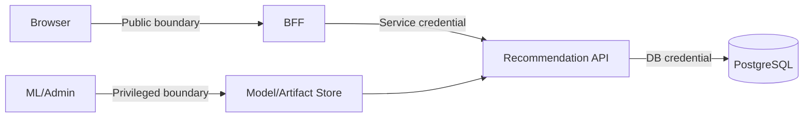

# Kiến trúc bảo mật

| Thuộc tính | Giá trị |
|---|---|
| **Mã tài liệu** | `SEC-01` |
| **Phiên bản** | `1.0.0` |
| **Ngày cập nhật** | `2026-07-18` |
| **Trạng thái** | Baseline thiết kế |
| **Chủ sở hữu** | Nhóm dự án RecoBridge |

> **Quy ước:** Nội dung ghi **MVP** là phạm vi phải demo. Nội dung ghi **Target** là kiến trúc định hướng, không được trình bày như chức năng đã hiện thực nếu chưa có bằng chứng chạy thực tế.

## 1. Security objectives

- Chỉ consumer được cấp quyền mới gọi recommendation/event admin endpoints.
- Dữ liệu truyền qua TLS ở môi trường triển khai.
- Không rò secret, PII hoặc internal error.
- Tách quyền serving, event write và model admin.

## 2. Trust boundaries

## 3. Authentication/authorization

MVP dùng một opaque Bearer service token cho BFF, đọc từ environment và so sánh constant-time. JWT/OAuth với audience/issuer/expiry validation là target sau MVP.

Scopes đề xuất:

- `reco:read`
- `events:write`
- `models:read`
- `models:admin`

Không dùng FastAPI sample “username làm token” như production security.

## 4. Secret management

- `.env.example` chỉ có tên biến, không có secret thật.
- Secret không commit Git.
- Các tiến trình đọc environment/secret file local.
- Rotate credential nếu lộ trong log/commit.

## 5. Input and abuse controls

- Pydantic/OpenAPI schema validation.
- Limit `top_k`, array size, string length.
- Rate limit theo consumer.
- SQL parameterization.
- File/model artifact checksum và path allowlist.
- Không deserialize artifact không tin cậy.

## 6. Data protection

- User IDs pseudonymous.
- Encrypt at rest nếu dùng dữ liệu thật.
- Retention policy và least privilege.
- Audit model promotion và admin actions.
