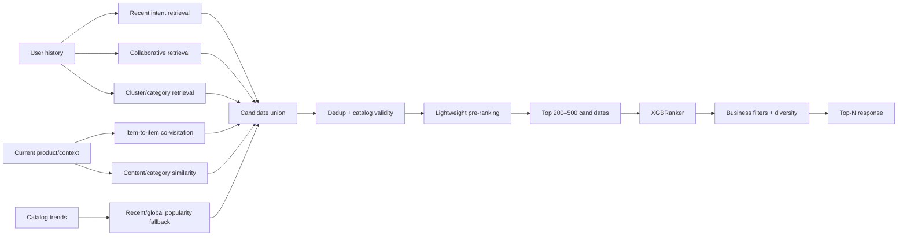

# RecoBridge — Phân tích nút thắt hiện tại và kế hoạch hoàn thiện

| Thuộc tính | Giá trị |
|---|---|
| **Mã tài liệu** | `DEL-09` |
| **Phiên bản** | `1.0.0` |
| **Ngày cập nhật** | `2026-07-24` |
| **Trạng thái** | Kế hoạch hoàn thiện sau release baseline |
| **Phạm vi** | Candidate generation, evaluation, XGBRanker promotion và hoàn thiện minh chứng đề tài |
| **Nguồn sự thật chính** | `README.md`, `docs/VALIDATION_REPORT.md`, `docs/07_DELIVERY/08_Release_Evidence.md`, `docs/00_GOVERNANCE/04_Product_MVP_Baseline.md`, `apps/ml/recobridge_ml/train.py` |

> **Quy ước**
>
> - **Hiện trạng xác nhận**: đã có bằng chứng trong repository hoặc release evidence.
> - **Đề xuất**: phương án kỹ thuật cần triển khai và kiểm chứng, không được trình bày như chức năng đã hoàn thành.
> - Không hạ promotion gate chỉ để model đạt trạng thái `promoted`. Mọi thay đổi phải có thí nghiệm, ADR và cập nhật governance.

---

## 1. Tóm tắt điều hành

Nút thắt chính của RecoBridge hiện không nằm ở website, REST API, PostgreSQL, idempotency hay hiệu năng phục vụ. Nút thắt nằm ở **candidate generation** — bước truy hồi tập sản phẩm ứng viên trước khi XGBRanker thực hiện xếp hạng.

Release hiện tại đã xác nhận:

- website, BFF và Recommendation API chạy end-to-end;
- PostgreSQL ghi nhận exposure/feedback bền vững;
- API, web và smoke test đều đạt;
- p95 của API là `6.069 ms`, thấp hơn ngưỡng `200 ms`;
- XGBRanker đã được huấn luyện;
- validation NDCG@10 của ranker là `0.036941`;
- test NDCG@10 của ranker là `0.033462`;
- candidate Recall@200 chỉ đạt `0.064998`;
- production đang sử dụng `category_popular`;
- XGBRanker vẫn là candidate và chưa được promote.

Nguyên tắc cốt lõi:

> XGBRanker chỉ có thể sắp xếp các sản phẩm đã xuất hiện trong candidate pool. Nếu sản phẩm liên quan không được truy hồi, tuning ranker không thể khôi phục sản phẩm đó.

Do đó, hướng hoàn thiện ưu tiên là:

1. chẩn đoán chi tiết candidate miss;
2. kiểm tra bất nhất giữa filter và cách tính Recall@200;
3. bổ sung retrieval source có tính cá nhân hóa cao hơn;
4. tăng raw candidate pool và thêm pre-ranking;
5. chỉ tiếp tục tuning XGBRanker sau khi candidate recall được cải thiện;
6. cập nhật đầy đủ release evidence, validation report và nội dung bảo vệ.

---

## 2. Hiện trạng đã được xác nhận

### 2.1. Các gate đã đạt

| Gate | Trạng thái | Bằng chứng |
|---|---|---|
| Data Ready | PASS | Curated data, manifest, quality report, split manifest |
| Model Ready | PASS | K-Means, baselines, XGBRanker, metrics và checksums |
| API Ready | PASS | 9 FastAPI tests |
| Web Ready | PASS | lint, production build và 3 render/BFF tests |
| PostgreSQL ingestion | PASS | durable exposure/feedback, replay dedup |
| Performance | PASS | 1.000 ASGI requests, p95 `6.069 ms` |
| Live smoke | PASS | hai user release cho kết quả khác nhau; anonymous fallback |
| Ranker promotion | **BLOCKED** | candidate Recall@200 `0.064998 < 0.70` |

Nguồn:

- `docs/07_DELIVERY/08_Release_Evidence.md`
- `docs/VALIDATION_REPORT.md`
- `README.md`

### 2.2. Production strategy hiện tại

Production alias đang trỏ tới bundle baseline được bảo vệ bằng checksum:

```text
apps/ml/artifacts/models/release/production.json
```

Strategy mặc định:

```text
category_popular
```

Cách trình bày được phép:

> “XGBRanker đã được huấn luyện và cải thiện thứ hạng trong số các candidate được truy hồi. Tuy nhiên, candidate Recall@200 chưa đạt promotion gate, nên production sử dụng baseline mạnh nhất đã được xác thực.”

Không được trình bày:

> “Production recommendations hiện được sinh bởi XGBoost.”

---

## 3. Nút thắt kỹ thuật

### 3.1. Candidate generation là bottleneck chính

Candidate generator hiện union các nguồn:

1. `recent_popular`: tối đa 60;
2. `cluster_popular`: tối đa 60;
3. `category_affinity`: tối đa 60;
4. `item_similarity`: tối đa 40;
5. refill bằng `global_popular`;
6. deduplicate;
7. loại sản phẩm đã mua gần đây;
8. cắt candidate pool ở 200.

Cấu hình này được xác nhận trong:

- `docs/00_GOVERNANCE/04_Product_MVP_Baseline.md`;
- `apps/ml/recobridge_ml/train.py`;
- artifact `candidate_config.json` được tạo bởi training pipeline.

### 3.2. Ý nghĩa của Recall@200 hiện tại

Candidate Recall@200:

\[
Recall@200 =
\frac{\text{số positive item xuất hiện trong 200 candidates}}
{\text{tổng số positive item trong target window}}
\]

Release hiện tại:

\[
Recall@200 = 0.064998 \approx 6.50\%
\]

Điều này có nghĩa phần lớn positive item không xuất hiện trong candidate pool trước khi ranker hoạt động.

### 3.3. Tại sao tuning XGBoost chưa phải ưu tiên

Commit gần nhất chỉ thay đổi:

- `n_estimators`: `220 → 150`;
- `learning_rate`: `0.05 → 0.06`;
- `max_depth`: `6 → 4`.

Các thay đổi này điều chỉnh khả năng xếp hạng của XGBRanker nhưng không mở rộng tập ứng viên. Khi candidate recall thấp, ranker bị giới hạn bởi trần retrieval.

Kết luận:

```text
Candidate recall thấp
        ↓
Positive item không có trong candidate pool
        ↓
XGBRanker không có cơ hội xếp hạng positive item
        ↓
NDCG/Recall top-K bị giới hạn
```

---

## 4. Nguyên nhân gốc cần kiểm chứng

Các nguyên nhân dưới đây được chia thành **đã xác nhận từ code** và **giả thuyết cần thí nghiệm**.

### 4.1. Đã xác nhận: phần lớn candidate source dựa trên popularity

Ba nguồn lớn nhất hiện tại là:

- recent popularity;
- cluster popularity;
- category popularity.

Các nguồn này phù hợp làm fallback và baseline, nhưng mức cá nhân hóa còn hạn chế, đặc biệt đối với:

- sở thích ngách;
- long-tail item;
- hành vi gần nhất;
- user có lịch sử mua đa dạng;
- next-item intent.

### 4.2. Đã xác nhận: item similarity hiện chủ yếu dựa trên co-occurrence đơn giản

Implementation hiện tại:

- lấy tối đa 10 item gần đây của user;
- tạo cặp đồng xuất hiện trong lịch sử;
- mỗi seed item lấy một số lượng hàng xóm giới hạn;
- gộp với item gần đây và category gần nhất;
- candidate similarity bị giới hạn trước khi cắt pool.

Đây chưa phải session-based co-visitation đầy đủ và chưa phân biệt:

- view → view;
- view → cart;
- cart → buy;
- buy → buy;
- khoảng cách thời gian giữa hai hành vi.

### 4.3. Đã xác nhận: quantized embedding retrieval chưa hiệu quả

Ablation với quantized embedding đã được thử nhưng:

- không cải thiện smoke Recall@200;
- làm giảm validation metrics;
- do đó không được bật trong release.

Không nên tiếp tục dựa vào quantized code như embedding ngữ nghĩa đầy đủ nếu chưa xác minh bản chất mã hóa.

### 4.4. Cần kiểm chứng: filter `recently_bought` có thể làm giảm raw recall

Candidate generation loại item user đã mua trong 14 ngày trước cutoff.

Trong khi đó, target window vẫn có thể chứa repeat-buy của cùng item. Training pipeline đã tính:

- `filtered_positive_labels`;
- `candidate_eligible_recall_at_200`;
- `candidate_recall_at_200`.

Nhưng promotion gate hiện kiểm tra raw `candidate_recall_at_200`.

Cần kiểm tra:

```text
filtered_positive_labels / positive_labels
candidate_recall_at_200
candidate_eligible_recall_at_200
```

Nếu eligible recall cao hơn raw recall đáng kể, một phần bottleneck đến từ cách định nghĩa evaluation contract.

### 4.5. Cần kiểm chứng: candidate cap 200 có thể được áp dụng quá sớm

Cần xây Recall@K curve:

```text
K ∈ {50, 100, 200, 300, 500, 1000}
```

Diễn giải:

- Recall@1000 vẫn thấp: retrieval source chưa đủ mạnh;
- Recall@1000 cao nhưng Recall@200 thấp: quota hoặc pre-ranking yếu;
- Recall giảm mạnh sau filter: candidate filtering cần điều chỉnh;
- một source chiếm phần lớn recall: cần tối ưu riêng source đó.

---

## 5. Mục tiêu hoàn thiện

### 5.1. Mục tiêu bắt buộc cho đề tài

1. Giữ demo end-to-end ổn định.
2. Giữ production fallback trung thực.
3. Có báo cáo bottleneck dựa trên metric thực nghiệm.
4. Có thí nghiệm candidate generation mới.
5. Có ablation giữa các retrieval source.
6. Có release decision rõ ràng: promote hoặc reject.
7. Có nội dung bảo vệ giải thích tại sao candidate generation giới hạn ranker.

### 5.2. Mục tiêu kỹ thuật đề xuất

| Mốc | Candidate Recall@200 đề xuất | Ý nghĩa |
|---|---:|---|
| Baseline hiện tại | `0.064998` | Mốc tham chiếu |
| Iteration 1 | `≥ 0.20` | Co-visitation/context tạo cải thiện rõ |
| Iteration 2 | `≥ 0.40` | Có retrieval cá nhân hóa thực chất |
| Iteration 3 | tiến tới `0.60–0.70` | Tiệm cận promotion gate hiện tại |

Các mốc trung gian là **đề xuất quản trị thử nghiệm**, không thay thế promotion gate `0.70` đã chốt.

---

## 6. Kiến trúc candidate generation mục tiêu

### 6.1. Luồng đề xuất



### 6.2. Retrieval source mục tiêu

| Source | Vai trò | Mức ưu tiên |
|---|---|---:|
| Recent intent | Phản ánh ý định ngắn hạn | P0 |
| Item-to-item co-visitation | Sản phẩm thường được xem/mua cùng | P0 |
| Category affinity | Giữ tín hiệu sở thích ổn định | P0 |
| Recent/global popularity | Cold-start và fallback | P0 |
| Implicit ALS/BPR | Collaborative personalization | P1 |
| Content similarity | Item/user cold-start | P1 |
| Search-to-product mapping | Ý định từ từ khóa | P2 nếu schema hỗ trợ |

---

## 7. Thiết kế thí nghiệm theo giai đoạn

## 7.1. Giai đoạn A — Retrieval diagnostics

### Công việc

- [ ] Xuất Recall@50/100/200/300/500/1000.
- [ ] Xuất query coverage@K.
- [ ] Xuất recall theo source.
- [ ] Xuất recall theo user activity slice.
- [ ] Xuất recall theo item popularity slice.
- [ ] So sánh raw recall và eligible recall.
- [ ] Đo số positive bị loại bởi `recently_bought`.
- [ ] Đo candidate count trước/sau dedup và filter.
- [ ] Đo tỷ lệ candidate overlap giữa các source.

### Artifact bắt buộc

```text
apps/ml/artifacts/models/release/<version>/
├── retrieval_diagnostics.json
├── retrieval_recall_curve.csv
├── retrieval_source_ablation.json
├── retrieval_filter_impact.json
└── plots/
    ├── recall_at_k.png
    ├── source_recall_at_200.png
    └── recall_by_user_slice.png
```

### Acceptance

- Không có NaN/inf.
- Có metric trước và sau filter.
- Tổng recall theo source không được diễn giải như phép cộng đơn giản nếu candidate overlap.
- Báo cáo chỉ rõ ba nguyên nhân candidate miss lớn nhất.
- Mọi artifact chứa `git_commit`, data version, model version, seed và timestamp.

---

## 7.2. Giai đoạn B — Session/co-visitation retrieval

### Thiết kế

Xây trọng số co-visitation theo hành vi:

| Transition | Trọng số khởi đầu đề xuất |
|---|---:|
| `BUY → BUY` | 4.0 |
| `ADD_TO_CART → BUY` | 3.0 |
| `PAGE/VIEW → BUY` | 2.0 |
| `PAGE/VIEW → ADD_TO_CART` | 1.5 |
| `PAGE/VIEW → PAGE/VIEW` | 1.0 |

Áp time decay:

\[
score(i,j) =
\sum w_{event}(i,j)\times e^{-\lambda\Delta t}
\]

> Synerise schema hiện dùng `PAGE_VISIT` ở mức aggregate và chưa xác nhận ánh xạ URL thành SKU. Nếu không có item-level view hợp lệ, phase đầu chỉ dùng item events đã xác minh: `BUY`, `ADD_TO_CART`, `REMOVE_FROM_CART`.

### Candidate strategy đề xuất

```text
recent_popular        100
cluster_popular       100
category_affinity     100
co_visitation         200
global fallback       100
raw union cap         500–800
pre-rank output       200–500
```

### Acceptance

- Recall@200 cao hơn release baseline.
- Recall@500 được báo cáo.
- Không leakage: chỉ dùng events trước cutoff.
- Co-visitation table được version hóa và có checksum.
- Có ablation `with_co_visitation` vs `without_co_visitation`.

---

## 7.3. Giai đoạn C — Collaborative retrieval bằng implicit feedback

### Phương án

Ưu tiên một trong hai:

1. **Implicit ALS**
   - phù hợp implicit feedback;
   - triển khai tương đối đơn giản;
   - tạo top-N user-item candidates.

2. **BPR Matrix Factorization**
   - tối ưu pairwise ranking;
   - phù hợp khi muốn thử nghiệm sâu hơn;
   - cần negative sampling và tuning cẩn thận hơn.

### Weight đề xuất

```text
BUY            = 3.0
ADD_TO_CART    = 1.0
REMOVE_FROM_CART = 0.0 hoặc tín hiệu giảm trọng số
```

Không được tự động coi mọi unobserved item là negative tuyệt đối.

### Acceptance

- ALS/BPR candidate recall cao hơn source popularity riêng lẻ.
- Có cold-start fallback.
- Có ablation:
  - popularity only;
  - co-visitation only;
  - collaborative only;
  - union;
  - union + pre-ranking.
- Inference không làm API vượt p95 budget.

---

## 7.4. Giai đoạn D — Pre-ranking và XGBRanker retraining

### Điều kiện bắt đầu

Chỉ bắt đầu khi retrieval diagnostics cho thấy candidate recall đã cải thiện đáng kể.

### Pre-ranking đề xuất

Feature nhẹ:

- reciprocal source rank;
- số source cùng truy hồi item;
- co-visitation score;
- ALS/BPR score;
- item recent popularity;
- category affinity;
- time since last category interaction;
- same last category;
- price affinity;
- catalog validity.

### XGBRanker feature bổ sung

- `collaborative_score`;
- `co_visitation_score`;
- `source_count`;
- `recent_intent_score`;
- `time_since_last_user_item_event`;
- `time_since_last_category_event`;
- `item_trend_velocity`;
- `repeat_purchase_interval`;
- `is_replenishable_candidate` nếu dữ liệu hỗ trợ.

### Acceptance

Ranker chỉ được promote khi đồng thời đạt toàn bộ gate trong `GOV-04`:

- validation NDCG@10 tăng ít nhất 3% tương đối;
- test NDCG@10 không thấp hơn baseline quá 1%;
- candidate Recall@200 ≥ 0.70;
- coverage@10 ≥ 90% baseline;
- không leakage/schema mismatch;
- artifact checksum hợp lệ;
- API p95 ≤ 200 ms.

---

## 8. Điều chỉnh filter repeat-buy

### 8.1. Vấn đề

Filter hiện tại loại mọi item đã mua trong 14 ngày trước cutoff.

Giả định ngầm:

> item đã mua gần đây không nên được gợi ý lại.

Giả định này không đúng cho mọi danh mục, đặc biệt với:

- sản phẩm tiêu hao;
- hàng mua định kỳ;
- item thường được mua lặp;
- người dùng quay lại add-to-cart item cũ.

### 8.2. Thí nghiệm bắt buộc

So sánh:

| Variant | Chính sách |
|---|---|
| A | Filter 14 ngày như hiện tại |
| B | Filter 3 ngày |
| C | Không filter trong candidate evaluation |
| D | Giảm score thay vì loại |
| E | Filter theo repeat-purchase propensity |

### 8.3. Quy tắc báo cáo

Báo cáo song song:

```text
raw_candidate_recall_at_200
eligible_candidate_recall_at_200
filtered_positive_labels
repeat_buy_positive_labels
```

Không thay promotion metric trước khi có quyết định governance.

---

## 9. Candidate quota động

Quota cố định không phù hợp cho mọi user.

### 9.1. Phân loại user đề xuất

| User type | Điều kiện ví dụ | Retrieval ưu tiên |
|---|---|---|
| Anonymous | không có `user_id` | recent/global/category |
| New | rất ít event | content/category/popular |
| Sparse | ít item interactions | co-visitation/category |
| Active | lịch sử đủ dày | collaborative + recent intent |
| Repeat buyer | có pattern mua lặp | replenishment + collaborative |

### 9.2. Ví dụ quota

```yaml
anonymous:
  recent_popular: 200
  category_popular: 150
  global_popular: 150

sparse:
  co_visitation: 200
  category_affinity: 150
  recent_popular: 100
  global_popular: 50

active:
  collaborative: 250
  co_visitation: 200
  recent_intent: 150
  category_affinity: 100
  popular_fallback: 50
```

Quota trên là điểm bắt đầu cho thí nghiệm, không phải cấu hình production đã chốt.

---

## 10. Backlog triển khai

| ID | P | Hạng mục | Đầu ra | Acceptance |
|---|---:|---|---|---|
| RB-018 | P0 | Retrieval diagnostics | JSON/CSV/plots theo K và source | xác định top-3 nguyên nhân miss |
| RB-019 | P0 | Filter impact analysis | raw vs eligible recall report | đo repeat-buy/filter loss |
| RB-020 | P0 | Co-visitation retrieval | versioned lookup + source metrics | Recall@200 tăng so với release |
| RB-021 | P0 | Candidate union v2 | candidate config v2 | không leakage, cap rõ ràng |
| RB-022 | P0 | Recall@K experiment | 50–1000 curve | xác định bottleneck source hay cap |
| RB-023 | P1 | Implicit ALS/BPR | model artifact + candidate report | vượt popularity source |
| RB-024 | P1 | Dynamic quota | user routing policy | slice metrics không suy giảm nghiêm trọng |
| RB-025 | P1 | Pre-ranking | pre-rank model/rules | giảm pool mà giữ recall |
| RB-026 | P1 | XGBRanker retraining | model v3 + evaluation | chạy lại promotion gates |
| RB-027 | P0 | Release evidence update | DEL-08 vNext | câu chữ production trung thực |
| RB-028 | P0 | Defense update | slide/script/FAQ | giải thích bottleneck và trade-off |

### Dependency

```text
RB-018 ─┬─> RB-019
        ├─> RB-020 ─> RB-021 ─> RB-022
        └──────────────────────────────┐
                                      v
RB-023 ─> RB-024 ─> RB-025 ─> RB-026 ─> RB-027 ─> RB-028
```

---

## 11. Kế hoạch thực hiện đề xuất

### Sprint 1 — Chẩn đoán

Mục tiêu: biết chính xác positive item mất ở đâu.

- triển khai RB-018;
- triển khai RB-019;
- tạo Recall@K curve;
- tạo source ablation;
- không tuning XGBRanker.

**Definition of Done**

- có report theo source, user slice và filter;
- có kết luận dựa trên số liệu;
- không thay governance gate.

### Sprint 2 — Co-visitation và candidate v2

Mục tiêu: tăng retrieval quality bằng tín hiệu item-to-item.

- triển khai RB-020;
- triển khai RB-021;
- thử raw pool 500–800;
- pre-rank về 200–500;
- chạy ablation.

**Definition of Done**

- Recall@200 cao hơn `0.064998`;
- có report before/after;
- không tăng latency request path quá budget.

### Sprint 3 — Collaborative retrieval

Mục tiêu: bổ sung personalization thực chất.

- triển khai ALS hoặc BPR;
- union với co-visitation;
- dynamic quota;
- đánh giá user slice.

**Definition of Done**

- collaborative source có đóng góp recall độc lập;
- cold-start không suy giảm;
- artifact reproducible.

### Sprint 4 — Ranker và release

Mục tiêu: retrain XGBRanker trên candidate pool mới.

- bổ sung feature;
- retrain;
- bootstrap evaluation;
- chạy promotion;
- cập nhật release evidence;
- cập nhật slide và defense script.

**Definition of Done**

- có quyết định promote/reject tự động;
- production alias đúng với release decision;
- README và tài liệu không mâu thuẫn.

---

## 12. Test strategy

### 12.1. Unit tests

- candidate source không chứa item invalid;
- candidate dedup đúng;
- candidate cap đúng;
- filter được áp dụng đúng policy;
- source rank ổn định;
- time cutoff không leakage;
- co-visitation không dùng target events;
- dynamic quota mapping đúng user type.

### 12.2. ML tests

- Recall@K reproducible cùng seed;
- qid contiguous;
- feature order đúng schema;
- model artifact checksum;
- source ablation chạy được;
- train/validation/test split không overlap;
- candidate recall không bị tính sai mẫu số.

### 12.3. Integration tests

- API load candidate config v2;
- production alias rollback được;
- anonymous fallback vẫn hoạt động;
- personalized users cho top-N khác nhau;
- exposure và feedback vẫn durable;
- model version trả đúng.

### 12.4. Failure tests

- candidate artifact thiếu → readiness fail hoặc fallback hợp lệ;
- checksum mismatch → không load model;
- PostgreSQL lỗi → recommendation vẫn có thể trả fallback;
- event commit lỗi → API trả lỗi, không báo thành công giả;
- promotion fail → production alias vẫn giữ baseline.

---

## 13. Rủi ro và biện pháp kiểm soát

| Rủi ro | Hậu quả | Kiểm soát |
|---|---|---|
| Tăng candidate pool quá lớn | train/inference chậm | raw retrieval + pre-ranking |
| Co-visitation bị popularity bias | head item lấn át | normalize, decay, source quota |
| ALS ưu tiên user hoạt động cao | sparse user yếu | slice evaluation + fallback |
| Repeat-buy filter sai | recall bị giảm giả tạo | raw/eligible metric song song |
| Hạ gate để pass | mất tính trung thực | ADR + governance approval |
| Dùng target event trong retrieval | leakage | cutoff-aware unit test |
| Embedding code không có nghĩa khoảng cách | retrieval sai | chỉ dùng sau schema validation |
| Offline tốt nhưng online chưa biết | kết luận quá mức | chỉ tuyên bố offline evidence |
| Quá nhiều hạng mục ngoài rubric | phân tán nguồn lực | ưu tiên P0 theo đề bài |

---

## 14. Tác động đến tiêu chí học phần

Đề tài yêu cầu:

| Tiêu chí | Trọng số | RecoBridge hiện tại |
|---|---:|---|
| Kiến trúc tích hợp | 30% | đã có Data Flow, Sequence, REST/BFF/API |
| Tính toàn vẹn dữ liệu | 30% | durable commit, idempotency, fallback, error handling |
| Hiện thực hóa | 30% | web + API + PostgreSQL + ML artifact chạy thật |
| Thuyết trình | 10% | cần trình bày đúng trade-off và bottleneck |

Candidate Recall@200 thấp không phủ nhận toàn bộ giá trị đề tài. Ngược lại, đây là bằng chứng cho thấy nhóm đã:

- xây promotion gate;
- đo được giới hạn thực tế;
- từ chối promote model không đạt;
- giữ fallback an toàn;
- phân biệt candidate generation và ranking;
- không hard-code kết quả.

Đây là luận điểm kỹ thuật nên nhấn mạnh khi bảo vệ.

---

## 15. Nội dung trình bày khi bảo vệ

### 15.1. Câu trình bày chính

> RecoBridge sử dụng kiến trúc hai tầng: candidate generation và XGBRanker re-ranking. Trong release hiện tại, ranker đã được huấn luyện nhưng candidate Recall@200 chỉ đạt 6,5%, nên hệ thống không promote XGBRanker và sử dụng category-popular fallback đã được kiểm chứng. Kết quả này cho thấy nút thắt nằm ở retrieval chứ không nằm ở REST API hoặc tốc độ inference.

### 15.2. Khi giảng viên hỏi “Tại sao không dùng XGBoost production?”

> Vì XGBoost không thể xếp hạng sản phẩm không tồn tại trong candidate pool. Promotion gate yêu cầu Recall@200 tối thiểu 0,70, trong khi release hiện tại chỉ đạt 0,064998. Việc giữ baseline production là quyết định có kiểm soát, tránh trình bày sai trạng thái model.

### 15.3. Khi hỏi “Vậy XGBoost có thất bại không?”

> XGBRanker không thất bại về mặt training. Nó tạo được model và metric hợp lệ. Gate thất bại ở candidate retrieval. Đây là lỗi ở tầng trước ranker, nên hướng khắc phục là bổ sung co-visitation, collaborative retrieval và pre-ranking trước khi tuning XGBoost tiếp.

### 15.4. Khi hỏi “Tại sao không hạ threshold?”

> Threshold là một governance decision. Nhóm không hạ ngưỡng để làm đẹp kết quả. Chỉ thay đổi sau khi có Recall@K curve, phân tích filter, ablation và ADR chứng minh ngưỡng cũ không phù hợp với dataset hoặc mục tiêu hệ thống.

### 15.5. Khi hỏi “Hệ thống có chạy thật không?”

> Có. Website gọi BFF, BFF gọi Recommendation API, API load release bundle, exposure và feedback được ghi vào PostgreSQL với idempotency. Smoke test và performance test đã pass; production hiện dùng baseline fallback thay vì JSON hard-code.

---

## 16. Các tài liệu cần cập nhật sau mỗi iteration

| Tài liệu | Nội dung cập nhật |
|---|---|
| `docs/00_GOVERNANCE/04_Product_MVP_Baseline.md` | chỉ cập nhật nếu thay gate hoặc candidate contract |
| `docs/04_ML/01_ML_Problem_and_Strategy.md` | retrieval v2, collaborative source |
| `docs/04_ML/02_Feature_Engineering.md` | feature mới |
| `docs/04_ML/03_Training_and_Evaluation.md` | Recall@K, ablation, filter analysis |
| `docs/04_ML/04_Model_Serving_and_MLOps.md` | artifact và promotion flow |
| `docs/07_DELIVERY/02_Test_Strategy.md` | test retrieval mới |
| `docs/07_DELIVERY/04_Risk_Register.md` | candidate miss/filter risk |
| `docs/07_DELIVERY/07_Implementation_Backlog.md` | RB-018 đến RB-028 |
| `docs/07_DELIVERY/08_Release_Evidence.md` | metrics và release decision mới |
| `docs/VALIDATION_REPORT.md` | trạng thái gate |
| `README.md` | production strategy và demo wording |
| `docs/07_DELIVERY/RecoBridge_Defense_2026.pptx` | bottleneck, evidence, next iteration |

---

## 17. Quy tắc hoàn thành

Một iteration chỉ được coi là hoàn thành khi:

- [ ] code đã merge;
- [ ] test pass;
- [ ] artifact có checksum;
- [ ] metric JSON được lưu;
- [ ] report có git commit và model version;
- [ ] release decision được sinh tự động;
- [ ] production alias khớp release decision;
- [ ] README và release evidence được cập nhật;
- [ ] nội dung slide không nói quá bằng chứng;
- [ ] không dùng notebook làm implementation chính.

---

## 18. Quyết định ưu tiên cuối cùng

### Phải làm ngay

1. Retrieval diagnostics.
2. Raw vs eligible recall analysis.
3. Recall@K curve.
4. Co-visitation retrieval.
5. Candidate union v2.
6. Retrain và chạy lại promotion gate.
7. Cập nhật release evidence và slide.

### Chưa nên làm

- Kafka;
- Kubernetes;
- Redis;
- online learning;
- A/B testing giả lập;
- dashboard quản trị riêng;
- tuning XGBoost liên tục khi candidate recall chưa cải thiện;
- thay đổi threshold không có bằng chứng.

---

## 19. Kết luận

RecoBridge đã vượt qua nút thắt “xây được hệ thống chạy thật” và hiện bước vào nút thắt chất lượng ML. Thành phần giới hạn toàn hệ thống là candidate retrieval.

Hướng hoàn thiện đúng không phải là tiếp tục tăng độ phức tạp của XGBRanker, mà là:

```text
Đo candidate miss
    → sửa evaluation/filter
    → bổ sung retrieval source
    → tăng raw candidate pool
    → pre-rank
    → retrain XGBRanker
    → promotion gate
    → cập nhật release evidence
```

Việc XGBRanker chưa được promote không phải là lý do để che giấu kết quả. Đây là bằng chứng thực nghiệm cho thấy nhóm hiểu đúng kiến trúc recommendation nhiều tầng, có khả năng kiểm soát model release và không đánh đồng “train thành công” với “đủ điều kiện production”.

---

## 20. Tài liệu tham chiếu trong repository

1. `README.md`
2. `docs/VALIDATION_REPORT.md`
3. `docs/CHANGELOG.md`
4. `docs/00_GOVERNANCE/04_Product_MVP_Baseline.md`
5. `docs/04_ML/03_Training_and_Evaluation.md`
6. `docs/07_DELIVERY/07_Implementation_Backlog.md`
7. `docs/07_DELIVERY/08_Release_Evidence.md`
8. `apps/ml/recobridge_ml/train.py`
9. `apps/ml/recobridge_ml/promote.py`
10. `apps/api/recobridge_api/engine.py`
